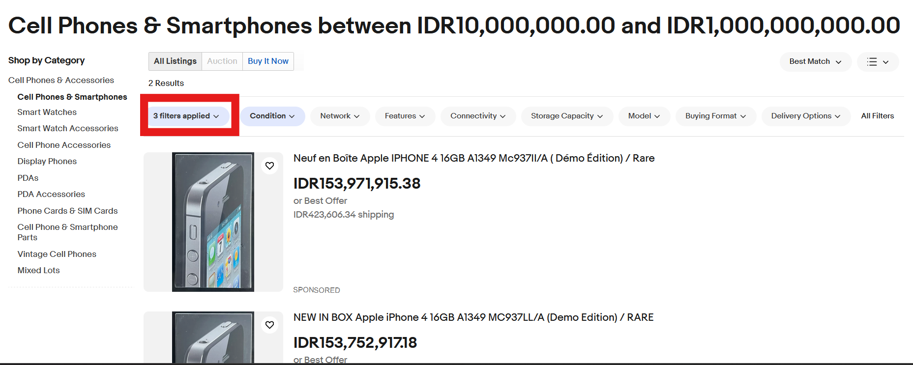
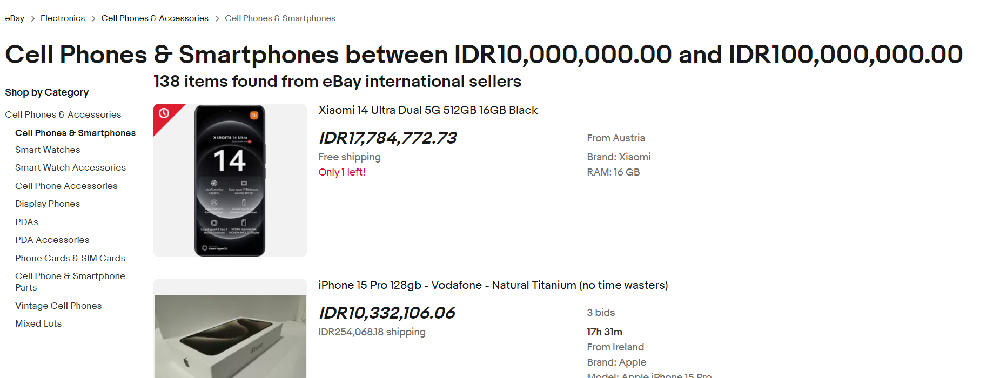
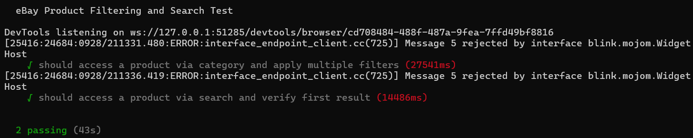

# How to run
run this script: 

```
npm install selenium-webdriver mocha chai chromedriver
```
```
npx mocha test/ebay.test.js 
```

# Scenario 1
- The script navigates to eBay, selects the "Electronics" category, drills down into "Cell Phones & Accessories" → "Cell Phones & Smartphones".
- Then, it applies three filters (Condition, Price, and Item Location), and verifies that the filters are applied successfully by checking the tags.

Steps:
- Find hyperlink using ```By.linkText``` on selenium to navigate to page "Cell Phones & Smartphones".
- Using ```window.scroll``` because user need to scroll down to see the filter.
- Using ```By.Xpath``` to find the filter category, in this case Condition and Item Location is using checked box, just need to ```.click()``` the element, and the price need to fill by ```sendKeys()``` command.
- Click the button Apply using  ```By.Xpath```.
- Do assertion for the filter applied using using  ```By.Xpath``` and ```expect``` command.

There is different between real browser and automation browser that makes different assertion, i added both of the case but on the comment (for real browser)

## Real Browser


## Automation Browser

no filter appeared when using same steps

## Code assertion for real browser
I added more assertion for filter here
```
    // # Real Browser
    let appliedFilter = await driver.wait(until.elementLocated(By.xpath('//button[span[contains(text(),"3 filters applied")]]')));
    await appliedFilter.click();


    await driver.wait(until.elementLocated(By.xpath("//span[contains(text()='Condition: New')]")), 10000);
    await driver.wait(until.elementLocated(By.xpath("//span[contains(text(), 'Price: $10,000,000.00 to $100,000,000.00')]")), 10000);
    await driver.wait(until.elementLocated(By.xpath("//span[contains(text()='Item Location: US Only')]")), 10000);

    const conditionTag = await driver.findElement(By.xpath("//span[contains(text()='Condition: New')]")).isDisplayed();
    const priceTag = await driver.findElement(By.xpath("//span[contains(text(), 'Price: $10,000,000.00 to $100,000,000.00')]")).isDisplayed();
    const locationTag = await driver.findElement(By.xpath("//span[contains(text()='Item Location: US Only')]")).isDisplayed();

    expect(conditionTag).to.be.true;
    expect(priceTag).to.be.true;
    expect(locationTag).to.be.true;
```


# Scenario 2
- The script enters a search term (e.g., "MacBook") in the search bar, selects a category (e.g., "Computers/Tablets & Networking"), and verifies that the page loads correctly and the first search result matches the search term.

Steps:
- Find the search bar using ```By.id``` and fill it "Macbook" using ```sendKeys()``` command.
- Find the category using ```By.id``` and find "Computers/Tablets & Networking" using ```sendKeys()``` command.
- Click the button Apply using  ```By.Id```.
- Do assertion for the page title to contains "Macbook" to check if the page is loads correctly and get the result using
```.titleContains``` and ```expect``` command,
- Do assertion for the first search result to contains "Macbook" using ```By.css(".s-item__title > span > span``` abd ```expect``` command.


# Result for both scenario

